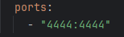

# SeleniumDocker_Python
Dự án kiểm thử demo bằng Selenium và Docker

# **I - Tải thư viện cho dự án:**
**Lệnh khởi cài đặt cho dự án:**
- python -m venv venv hoặc python -m venv venv --without-pip
- .\venv\Scripts\activate  (hoặc source venv/bin/activate trên mac/linux)
- pip install -r requirements.txt

**_Lưu ý:_** Nếu khởi động lệnh chạy lỗi, kiểm tra lỗi gặp phải được trả về:

**Khắc phục lỗi "UnauthorizedAccess" trong PowerShell:**
1. Mở  PowerShell với quyền quản trị (Administrator)
2. Kiểm tra chính sách bảo mật
   - Gõ lệnh : `Get-ExecutionPolicy`
   -> Nếu kết quả trả về là Restricted hoặc AllSigned, thì chính sách này ngăn không cho chạy các script chưa ký.
3. Thay đổi chính sách bảo mật

Có 2 loại:

- `RemoteSigned` cho phép chạy các script trên máy tính của bạn, nhưng yêu cầu các script tải từ Internet phải có chữ ký xác thực.
- `Unrestricted` sẽ cho phép chạy tất cả các script (không khuyến khích nếu bạn không tin tưởng nguồn gốc script).

Gõ lệnh: `Set-ExecutionPolicy RemoteSigned` hoặc `Set-ExecutionPolicy Unrestricted` để thay đổi chính sách

4. Kích hoạt môi trường ảo
   - .\venv\Scripts\activate

**Khắc phục lỗi cài đặt thư viện Behave:**
1. Xóa môi trường ảo:
   - Xóa thư mục venv.\
2. Tạo lại môi trường ảo:
   - python -m venv venv
3. Kích hoạt lại môi trường ảo:
   - .\venv\Scripts\activate
4. Cài đặt lại tất cả các thư viện:
   - pip install -r requirements.txt
5. Cài đặt lại `behave`:
   - pip install behave

# **II - Khởi tạo docker container cho dự án:**

Lệnh khởi tạo:
- docker-compose up -d _//Tạo lại các container mới_
- docker-compose up --build _//Nếu cần build lại image khi có thay đổi code_

_**Lưu ý:**_ TH build không thành công khi đã tạo container, kiểm tra xem Python script từ máy host có connect được đến Grid không?
1. Docker container có đang chạy không?
   - Kiểm tra container có đang chạy không
   docker-compose ps
   - Nếu chưa chạy thì khởi động lại
   docker-compose up -d
   - Kiểm tra kết nối tới grid: http://localhost:4444/grid/console

→ Phải thấy container selenium-hub, chrome, firefox đang chạy.

2. Truy cập Grid UI xem thử có hoạt động không?
   - Truy cập: http://localhost:4444
   
Nếu không lên → có thể port 4444 không được expose đúng.

3. Kiểm tra "docker-compose.yml"
   - Đảm bảo có dòng:

     

4. Thử curl hoặc ping từ host
   - Chạy dòng lệnh: curl http://localhost:4444/status

→ Nếu trả về JSON với ready: true là ok.

5. Sau khi làm toàn bộ các bước trên mà vẫn ko fix được lỗi build, hãy xóa hết các container rồi khởi động lại.
   - docker-compose down
   - docker-compose up -d
   - docker-compose up --build
