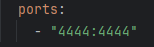

# SeleniumDocker_Python
Dự án kiểm thử demo bằng Selenium và Docker

Khởi tạo docker container cho dự án:
- docker-compose up -d _//Tạo lại các container mới_
- docker-compose up --build _//Nếu cần build lại image khi có thay đổi code_

_**Lưu ý:**_ TH build không thành công khi đã tạo container, kiểm tra xem Python script từ máy host có connect được đến Grid không?
1. Docker container có đang chạy không?
- Kiểm tra container có đang chạy không
docker-compose ps
- Nếu chưa chạy thì khởi động lại
docker-compose up -d
- Kiểm tra kết nối tới grid: http://localhost:4444/grid/console

→ Phải thấy container selenium-hub, chrome, firefox đang chạy.

2. Truy cập Grid UI xem thử có hoạt động không?
- Truy cập: http://localhost:4444
Nếu không lên → có thể port 4444 không được expose đúng.

3. Kiểm tra "docker-compose.yml"
- Đảm bảo có dòng:

  

4. Thử curl hoặc ping từ host
- Chạy dòng lệnh: curl http://localhost:4444/status

→ Nếu trả về JSON với ready: true là ok.

5. Sau khi làm toàn bộ các bước trên mà vẫn ko fix được lỗi build, hãy xóa hết các container rồi khởi động lại.
- docker-compose down
- docker-compose up -d
- docker-compose up --build